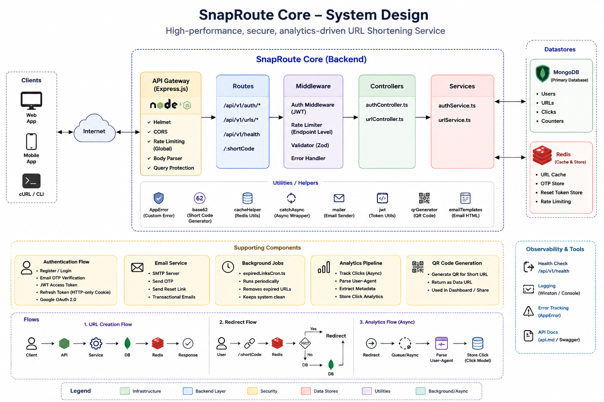

# 🔗 SnapRoute Core

> **A secure, high-performance, analytics-driven URL shortening service built with TypeScript, Node.js, Express, MongoDB, and Redis.**

SnapRoute Core is a production-oriented backend system for creating, managing, and analyzing shortened URLs.

The project goes beyond basic URL shortening by implementing **JWT authentication, Google OAuth, email verification, password recovery, Redis caching, rate limiting, URL analytics, QR-code generation, URL expiration, background jobs, request validation, and centralized error handling**.

---

## ✨ Features

### 🔗 URL Management

- Create shortened URLs
- Automatic short-code generation using Base62
- Custom aliases
- Alias availability checking
- Password-protected URLs
- URL expiration
- Favorite URLs
- URL tagging
- Archive / restore URLs
- Permanent URL deletion
- Bulk URL deletion
- QR-code generation
- Fast URL redirection

### 🔐 Authentication

- User registration
- Email OTP verification
- Login
- JWT access tokens
- JWT refresh tokens
- HTTP-only refresh-token cookies
- Google OAuth 2.0
- Protected routes
- Forgot-password flow
- Secure password reset
- Resend email verification

### 📊 Analytics

SnapRoute tracks URL usage without unnecessarily blocking the redirect flow.

Analytics can include:

- Click count
- Browser
- Operating system
- Device type
- Referrer
- Short-code activity

Analytics processing is performed asynchronously after successful URL resolution.

### ⚡ Redis

Redis is used for:

- URL caching
- Email verification OTPs
- Password-reset tokens
- Rate limiting
- Temporary application data

### 🛡️ Security

- Helmet security headers
- CORS configuration
- Global rate limiting
- Endpoint-specific rate limiting
- Redis-backed rate limiting
- Zod request validation
- bcrypt password hashing
- HTTP-only cookies
- `SameSite` cookie protection
- Secure cookies in production
- Cryptographically secure OTP generation
- SHA-256 hashed password-reset tokens
- Request body size limits
- Query-object protection
- Centralized error handling

### 🧹 Background Processing

Expired URLs are handled through:

```text
src/jobs/expiredLinksCron.ts
```

### 🩺 Health Monitoring

The health endpoint checks:

- MongoDB
- Redis

The API responds with `200` when both services are healthy and `503` when the infrastructure is degraded.

---

# 🏗️ System Design

SnapRoute Core follows a layered backend architecture designed around **security, performance, scalability, and separation of concerns**.

## Architecture Diagram

> **The system-design image is included directly below.**



The architecture covers:

- Client applications
- Express API
- Routes
- Security and middleware
- Controllers
- Services
- MongoDB
- Redis
- Authentication
- Email services
- Background jobs
- Analytics
- QR-code generation
- Health checks
- API documentation

### Core Request Flow

```text
Client
   │
   ▼
Express API
   │
   ▼
Routes
   │
   ▼
Middleware
   │
   ├── Authentication
   ├── Rate Limiting
   ├── Validation
   └── Error Handling
   │
   ▼
Controllers
   │
   ▼
Services
   │
   ├──────────────► MongoDB
   │
   └──────────────► Redis
                       │
                       ├── URL Cache
                       ├── OTP Storage
                       ├── Reset Tokens
                       └── Rate Limiting
```

---

# 📁 Project Structure

```text
12-URL-SHORTENING-SERVICE/
│
└── server/
    │
    ├── src/
    │   │
    │   ├── controllers/
    │   │   └── urlController.ts
    │   │
    │   ├── jobs/
    │   │   └── expiredLinksCron.ts
    │   │
    │   ├── middleware/
    │   │   ├── authMiddleware.ts
    │   │   ├── errorHandler.ts
    │   │   └── rateLimiter.ts
    │   │
    │   ├── models/
    │   │   ├── Click.ts
    │   │   ├── Counter.ts
    │   │   ├── Url.ts
    │   │   └── User.ts
    │   │
    │   ├── routes/
    │   │   ├── authRoutes.ts
    │   │   ├── healthRoutes.ts
    │   │   └── urlRoutes.ts
    │   │
    │   ├── services/
    │   │   ├── authService.ts
    │   │   └── urlService.ts
    │   │
    │   ├── types/
    │   │   ├── express.d.ts
    │   │   ├── url.ts
    │   │   └── user.ts
    │   │
    │   ├── utils/
    │   │   ├── AppError.ts
    │   │   ├── base62.ts
    │   │   ├── cacheHelper.ts
    │   │   ├── catchAsync.ts
    │   │   ├── emailTemplates.ts
    │   │   ├── jwt.ts
    │   │   ├── mailer.ts
    │   │   └── qrGenerator.ts
    │   │
    │   ├── validators/
    │   │   └── authValidator.ts
    │   │
    │   └── server.ts
    │
    ├── docs/
    │   └── system-design.png
    │
    ├── .env
    ├── .gitignore
    ├── docker-compose.yml
    ├── package.json
    ├── pnpm-lock.yaml
    ├── README.md
    ├── api.md
    ├── test.ts
    └── tsconfig.json
```

> `node_modules` and generated files are intentionally excluded.

---

# 🛠️ Tech Stack

| Category | Technology |
|---|---|
| Runtime | Node.js |
| Language | TypeScript |
| Framework | Express.js |
| Database | MongoDB |
| ODM | Mongoose |
| Cache | Redis |
| Authentication | JWT |
| OAuth | Passport + Google OAuth 2.0 |
| Validation | Zod |
| Security | Helmet |
| Password Hashing | bcrypt |
| Email | SMTP |
| Analytics | UAParser |
| QR Generation | QR Code Generator |
| Rate Limiting | Express Rate Limit + Redis |
| Package Manager | pnpm |
| Containerization | Docker Compose |
| API Documentation | API.md / OpenAPI |

---

# 🚀 Getting Started

## Prerequisites

- Node.js
- pnpm
- MongoDB
- Redis
- Docker *(optional)*
- Google OAuth credentials *(for Google login)*
- SMTP credentials *(for email verification and password reset)*

## 1. Clone the Repository

```bash
git clone <your-repository-url>
cd 12-URL-SHORTENING-SERVICE/server
```

## 2. Install Dependencies

```bash
pnpm install
```

## 3. Configure Environment Variables

Create a `.env` file inside the `server` directory.

```env
NODE_ENV=development
PORT=5000

MONGO_URI=mongodb://localhost:27017/snaproute
REDIS_URL=redis://localhost:6379

JWT_ACCESS_SECRET=your_access_secret
JWT_REFRESH_SECRET=your_refresh_secret

SESSION_SECRET=your_session_secret

ALLOWED_ORIGINS=http://localhost:5173
FRONTEND_URL=http://localhost:5173
BASE_URL=http://localhost:5000

GOOGLE_CLIENT_ID=your_google_client_id
GOOGLE_CLIENT_SECRET=your_google_client_secret
GOOGLE_CALLBACK_URL=http://localhost:5000/api/v1/auth/google/callback

SMTP_HOST=your_smtp_host
SMTP_PORT=587
SMTP_USER=your_smtp_username
SMTP_PASSWORD=your_smtp_password
```

> **Never commit `.env` or production secrets to Git.**

## 4. Start Infrastructure

Using Docker Compose:

```bash
docker compose up -d
```

Check containers:

```bash
docker compose ps
```

Stop containers:

```bash
docker compose down
```

## 5. Run the Server

Development:

```bash
pnpm dev
```

Build:

```bash
pnpm build
```

Production:

```bash
pnpm start
```

The exact commands depend on the scripts configured in `package.json`.

---

# 🔌 API Reference

Detailed API documentation is available in:

```text
api.md
```

## Authentication

Base route:

```text
/api/v1/auth
```

| Method | Endpoint | Access | Description |
|---|---|---|---|
| `POST` | `/register` | Public | Register a new user |
| `POST` | `/login` | Public | Authenticate user |
| `POST` | `/verify-email` | Protected | Verify email OTP |
| `POST` | `/resend-verification` | Protected | Resend verification OTP |
| `POST` | `/forgot-password` | Public | Request password reset |
| `POST` | `/reset-password/:token` | Public | Reset password |
| `GET` | `/google` | Public | Start Google OAuth |
| `GET` | `/google/callback` | OAuth | Handle Google OAuth callback |

## URL API

Base route:

```text
/api/v1/urls
```

| Method | Endpoint | Access | Description |
|---|---|---|---|
| `POST` | `/` | Protected | Create short URL |
| `GET` | `/` | Protected | Retrieve user's URLs |
| `POST` | `/bulk-delete` | Protected | Delete multiple URLs |
| `PATCH` | `/:id` | Protected | Update URL |
| `PATCH` | `/:id/archive` | Protected | Archive / restore URL |
| `DELETE` | `/:id` | Protected | Permanently delete URL |
| `GET` | `/:shortCode/analytics` | Public | Retrieve URL analytics |
| `POST` | `/:shortCode/verify-password` | Public | Verify protected URL |
| `GET` | `/check-alias/:alias` | Protected | Check alias availability |

## Health Check

```http
GET /api/v1/health
```

Example:

```json
{
  "status": "ok",
  "timestamp": "2026-08-14T12:00:00.000Z",
  "services": {
    "database": "UP",
    "cache": "UP"
  }
}
```

---

# ⚡ URL Redirection

Short URLs are handled through:

```http
GET /:shortCode
```

Example:

```text
http://localhost:5000/abc123
```

### Redirect Flow

```text
                 Request
                    │
                    ▼
              Redis Cache
                    │
          ┌─────────┴─────────┐
          │                   │
       Cache HIT          Cache MISS
          │                   │
          ▼                   ▼
       Redirect            MongoDB
                              │
                    ┌─────────┴─────────┐
                    │                   │
                  Valid              Invalid
                    │                   │
                    ▼                   ▼
                 Redirect             Error
                    │
                    ▼
             Cache destination
                    │
                    ▼
          Background analytics
```

For non-password-protected URLs, the destination can be cached in Redis to reduce repeated MongoDB lookups.

---

# 🔐 Authentication Flow

```text
                 Login
                   │
                   ▼
          Validate Credentials
                   │
                   ▼
            Generate Tokens
             │          │
             │          │
             ▼          ▼
       Access Token  Refresh Token
             │          │
             ▼          ▼
          Frontend   HTTP-only Cookie
```

Refresh-token cookies use:

```text
httpOnly: true
sameSite: strict
secure: true  // production
```

---

# 📧 Email Verification

```text
Register
   │
   ▼
Generate 6-digit OTP
   │
   ▼
Store OTP in Redis
   │
   │ 15-minute TTL
   ▼
Send Email
   │
   ▼
User submits OTP
   │
   ▼
Validate OTP
   │
   ▼
Mark Email Verified
   │
   ▼
Delete OTP
```

Verification codes expire automatically after **15 minutes**.

---

# 🔑 Password Reset

```text
Forgot Password
      │
      ▼
Generate Secure Token
      │
      ▼
SHA-256 Hash
      │
      ▼
Store Hash in Redis
      │
      │ 10-minute TTL
      ▼
Send Reset Link
      │
      ▼
Validate Token
      │
      ▼
Update Password
      │
      ▼
Delete Token
```

The raw reset token is not stored in Redis.

---

# ⚡ Redis Architecture

```text
Redis
│
├── URL Cache
│   └── url-cache:<shortCode>
│
├── Email Verification OTP
│   └── otp:verify:<userId>
│
├── Password Reset
│   └── password:reset:<hashedToken>
│
└── Rate Limiting
```

Redis therefore handles both **performance-critical caching** and **temporary security-sensitive data**.

---

# 🛡️ Rate Limiting

| Limiter | Window | Limit |
|---|---:|---:|
| Global API | 15 minutes | 100 requests |
| Authentication | 15 minutes | 10 requests |
| Standard Authentication | 15 minutes | 30 requests |
| URL Creation | 1 minute | 10 requests |
| URL Redirection | 1 minute | 120 requests |
| Analytics | 1 minute | 30 requests |

Sensitive endpoints receive stricter limits to reduce abuse and brute-force attempts.

---

# 📊 Analytics Pipeline

Analytics are designed to avoid unnecessarily delaying URL redirects.

```text
User
 │
 ▼
Short URL
 │
 ▼
Resolve URL
 │
 ▼
Redirect
 │
 └──────────────► Analytics
                     │
                     ▼
                Parse User Agent
                     │
                     ▼
                Extract Metadata
                     │
                     ▼
                Store Click Data
```

The system can record:

- Browser
- Operating system
- Device
- Referrer
- Short code
- Click count

---

# 🧹 Expired URL Processing

Expired URL management is handled by:

```text
src/jobs/expiredLinksCron.ts
```

The background job allows expired resources to be processed without requiring every user request to perform cleanup.

---

# 🔢 Base62 Short-Code Generation

The project includes:

```text
src/utils/base62.ts
```

Base62 uses:

```text
0-9
a-z
A-Z
```

This provides compact identifiers suitable for shortened URLs.

---

# 🖼️ QR Code Generation

QR codes are generated through:

```text
src/utils/qrGenerator.ts
```

The generated QR code can be returned as a data URL:

```text
data:image/png;base64,...
```

---

# 🧱 Error Handling

Centralized error handling is implemented through:

```text
src/utils/AppError.ts
src/utils/catchAsync.ts
src/middleware/errorHandler.ts
```

This provides consistent handling of:

- Application errors
- HTTP status codes
- Async controller errors
- Unexpected runtime errors

---

# ✅ Request Validation

Request validation is separated into:

```text
src/validators/
```

Schema-based validation prevents malformed request data from reaching the core business logic.

---

# 🧪 Testing

The repository contains:

```text
test.ts
```

Run the configured test command:

```bash
pnpm test
```

The actual test command is defined in `package.json`.

---

# 📚 Documentation

API documentation:

```text
api.md
```

System design:

```text
docs/system-design.png
```

---

# 🧠 Engineering Principles

### Separation of Concerns

```text
Routes
   ↓
Middleware
   ↓
Controllers
   ↓
Services
   ↓
Models
```

### Security

```text
Helmet
   +
CORS
   +
JWT
   +
HTTP-only Cookies
   +
bcrypt
   +
Zod
   +
Rate Limiting
   +
Redis TTL
   +
Secure Tokens
```

### Performance

```text
Redis Cache
     +
Background Analytics
     +
Efficient Short Codes
     +
Dedicated Rate Limits
```

---

# 🚧 Future Improvements

- [ ] Refresh-token rotation
- [ ] Token revocation and logout
- [ ] Advanced analytics dashboard
- [ ] Geographic analytics
- [ ] Link preview generation
- [ ] Custom domains
- [ ] API key authentication
- [ ] Team and workspace support
- [ ] Webhooks
- [ ] Abuse and spam detection
- [ ] Comprehensive unit and integration tests
- [ ] CI/CD pipeline
- [ ] Production Docker deployment
- [ ] Prometheus / Grafana monitoring
- [ ] OpenTelemetry tracing

---

# 👨‍💻 Author

**Darth**

SnapRoute Core was built to demonstrate practical backend engineering using:

**TypeScript · Express.js · MongoDB · Redis · JWT · OAuth · Caching · Rate Limiting · Analytics · Background Jobs · API Design · Security**

---

# ⭐ Project Summary

SnapRoute Core is more than a basic CRUD URL shortener. It combines:

```text
Authentication
      +
URL Management
      +
Redis Caching
      +
Rate Limiting
      +
Analytics
      +
Background Jobs
      +
Request Validation
      +
Security
      +
QR Generation
      +
API Documentation
```

> **SnapRoute Core — Short links. Fast redirects. Secure infrastructure.**