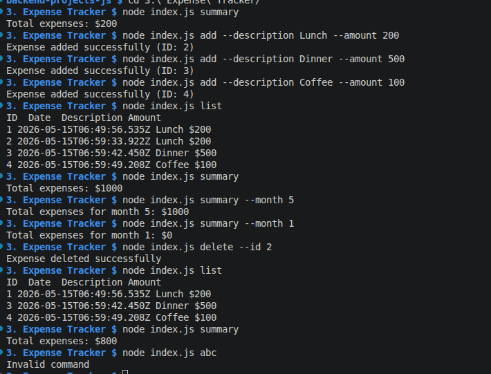

# Expense Tracker CLI


A simple command-line expense tracker application built with Node.js to manage personal finances.

Users can:

- Add expenses
- Delete expenses
- View all expenses
- View expense summaries
- View monthly expense summaries

Expenses are stored locally in a JSON file.

---

## Features

- Add an expense with description and amount
- Delete an expense by ID
- View all expenses
- View total expense summary
- View monthly expense summary
- Data persistence using JSON file
- Input validation
- Command-line interface (CLI)

---

## Tech Stack

- JavaScript (ES Modules)
- Node.js
- File System (`fs`)
- JSON Storage

---

## Project Structure

```bash
expense-tracker/
│
├── data/
│   └── expenses.json
│
├── services/
│   └── expenseService.js
│
├── storage/
│   └── fileStorage.js
│
├── index.js
├── package.json
└── README.md
```

---

## Installation

### 1. Clone the repository

```bash
git clone <your-repository-url>
```

### 2. Navigate to project folder

```bash
cd expense-tracker
```

### 3. Install dependencies

```bash
npm install
```

---

## Run the Application

All commands are executed using:

```bash
node index.js
```

---

## Commands

### Add Expense

```bash
node index.js add --description Lunch --amount 200
```

Example Output:

```bash
Expense added successfully (ID: 1)
```

---

### List Expenses

```bash
node index.js list
```

Example Output:

```bash
ID  Date                  Description Amount

1   2026-05-15T12:00:00  Lunch      $200
2   2026-05-15T12:10:00  Dinner     $500
```

---

### Delete Expense

```bash
node index.js delete --id 1
```

Example Output:

```bash
Expense deleted successfully
```

---

### View Summary

```bash
node index.js summary
```

Example Output:

```bash
Total expenses: $700
```

---

### View Monthly Summary

```bash
node index.js summary --month 5
```

Example Output:

```bash
Total expenses for month 5: $700
```

---

## Data Storage

Expenses are stored in:

```text
data/expenses.json
```

Example:

```json
[
  {
    "id": 1,
    "description": "Lunch",
    "amount": 200,
    "createdAt": "2026-05-15T10:30:00.000Z"
  }
]
```

---

## Validation

The application validates:

- Missing description
- Invalid amount
- Negative amount
- Invalid expense ID
- Non-existent expense deletion

---

## Example Workflow

```bash
node index.js add --description Lunch --amount 200

node index.js add --description Dinner --amount 500

node index.js list

node index.js summary

node index.js summary --month 5

node index.js delete --id 2
```

---

## Future Improvements

- Update expense feature
- Expense categories
- Budget tracking
- CSV export
- Better CLI formatting
- Command aliases

---

## License

This project is open source and available under the MIT License.