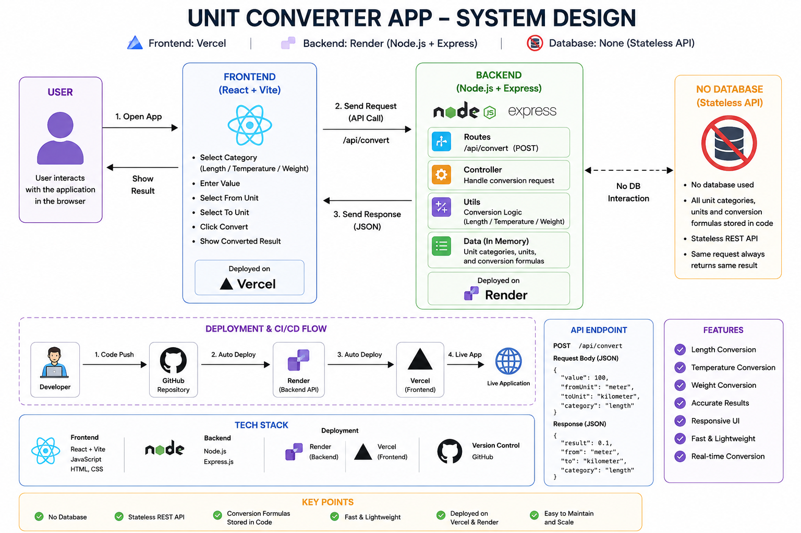
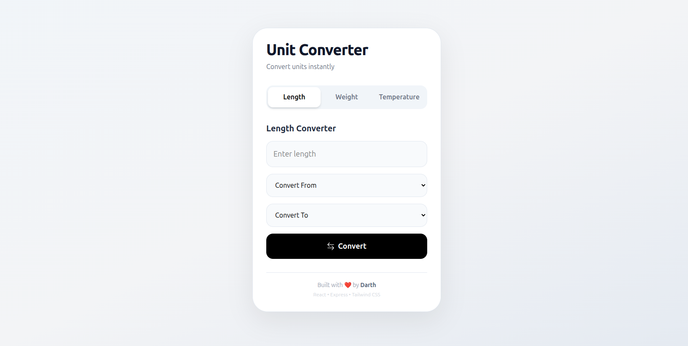

# 🚀 Unit Converter App



A full-stack **Unit Converter Web Application** built using **React, Express.js, and REST APIs**.

The application allows users to instantly convert units across different categories with a clean and responsive interface.

### Supported Conversions

- 📏 Length
- ⚖️ Weight
- 🌡️ Temperature

---

## 🌐 Live Demo



### Frontend

https://unit-converter-rose-two.vercel.app/

### Backend API

https://unit-converter-api-ds4g.onrender.com

---

## ✨ Features

✅ Length Conversion  
✅ Weight Conversion  
✅ Temperature Conversion  
✅ Responsive UI  
✅ Real-Time Result  
✅ REST API Architecture  
✅ Input Validation  
✅ Security Middleware  
✅ Rate Limiting  
✅ Modern UI Design

---

## 🛠️ Tech Stack

### Frontend

- React
- Vite
- Tailwind CSS
- Axios
- React Icons

### Backend

- Node.js
- Express.js
- Helmet
- Morgan
- Express Rate Limit
- CORS
- Zod

### Deployment

- Vercel (Frontend)
- Render (Backend)

---

## 🏗️ System Design

```txt
User
  ↓
React Frontend (Vercel)
  ↓ REST API Call
Express Backend (Render)
  ↓
Route Layer
  ↓
Controller Layer
  ↓
Service Layer
  ↓
Conversion Logic
  ↓
JSON Response
  ↓
Frontend Result UI
```

---

## 🔌 API Endpoint

### Convert Unit

```http
POST /api/convert
```

### Request Body

```json
{
  "type": "length",
  "value": 1000,
  "from": "meter",
  "to": "kilometer"
}
```

### Success Response

```json
{
  "result": 1
}
```

### Example

```txt
1000 meter → kilometer = 1
50 celsius → fahrenheit = 122
5 kilogram → gram = 5000
```

---

## 📂 Project Structure

```txt
5.UnitConverter/
│
├── backend/
│   ├── controllers/
│   ├── middleware/
│   ├── routes/
│   ├── services/
│   └── server.js
│
└── frontend/
    ├── src/
    └── public/
```

---

## 🔒 Security Features

- Helmet Security Headers
- CORS Protection
- Rate Limiting
- Request Payload Limit
- Input Validation with Zod

---

## ⚙️ Run Locally

### Clone Repository

```bash
git clone YOUR_REPO_URL
```

### Run Backend

```bash
cd backend
npm install
npm run dev
```

### Run Frontend

```bash
cd frontend
npm install
npm run dev
```

---

## 🚀 Deployment

### Frontend

Deployed on **Vercel**

### Backend

Deployed on **Render**

---

## 👨‍💻 Author

Built with ❤️ by **Pankaj**

---

## ⭐ Show Your Support

If you liked this project, give it a **star ⭐** on GitHub.