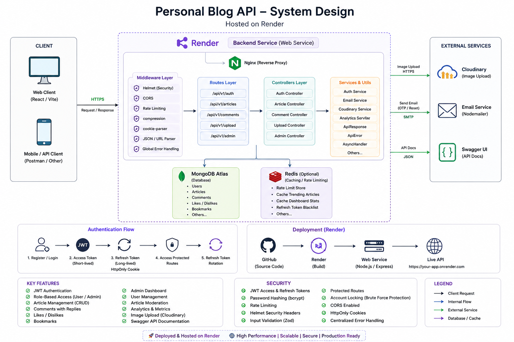

# Aarohan API 🚀



A **production-ready RESTful Blog Platform API** built with **Node.js, Express.js, MongoDB, and JWT Authentication**.

**Aarohan API** powers a modern blogging platform with secure authentication, article publishing, comments, bookmarks, analytics, admin moderation, file uploads, and API documentation.

Designed with **scalability, clean architecture, security, and maintainability** in mind.

---

## ✨ Features

### 🔐 Authentication & Authorization

* JWT Authentication (**Access + Refresh Tokens**)
* Secure Login / Logout
* Role-Based Access Control (**User / Admin**)
* Protected Routes
* Forgot Password with OTP Verification
* Password Reset Flow
* Refresh Token Rotation
* Brute-force Protection & Account Locking

---

### 📝 Article Management

* Create, Update & Delete Articles
* Draft & Published Status
* Slug-Based URLs
* Search & Pagination
* Category & Tag Filtering
* Sorting & Visibility Controls
* Trending & Recommended Articles
* Article Analytics

---

### ❤️ User Engagement

#### Reactions

* Like / Dislike Articles
* Toggle Reactions
* Engagement Analytics

#### Bookmarks

* Save & Remove Bookmarks
* Fetch User Bookmarks
* Published-only Bookmark Support

#### Comments

* Add, Edit & Delete Comments
* Nested Replies
* Comment Threads

---

### 👨‍💼 Admin Dashboard

#### User Management

* View & Search Users
* Lock / Unlock Accounts
* Update User Roles
* Suspend / Ban Users
* Delete Users

#### Content Moderation

* Moderate Articles
* Hide / Block Content
* Update Article Status
* Remove Articles

#### Dashboard Analytics

* User Metrics
* Article Metrics
* Trending Articles
* Latest Activity
* Platform Insights

---

### 📤 File Uploads

* Cloudinary Image Uploads
* Multipart Form Data Support
* JWT-Protected Upload Routes

---

### 🛡️ Security Features

* JWT Authentication
* Password Hashing with `bcrypt`
* Rate Limiting
* Helmet Security Headers
* Secure Cookies
* Zod Validation
* Centralized Error Handling
* Request Compression
* Account Lock Protection

---

## 🛠️ Tech Stack

### Backend

* Node.js
* Express.js
* MongoDB
* Mongoose

### Authentication & Security

* JWT
* bcrypt
* Helmet
* Express Rate Limit
* Cookie Parser
* Compression

### Validation

* Zod

### File Uploads

* Multer
* Cloudinary
* Streamifier

### API Documentation

* Swagger UI
* Swagger JSDoc

---

## 📂 Project Structure

```txt
backend/
│── config/
│── controllers/
│── middleware/
│── models/
│── routes/
│── services/
│── utils/
│── validators/
│── server.js
```

---

## ⚙️ Installation

### Clone Repository

```bash
git clone https://github.com/your-username/aarohan-api.git
cd backend
```

### Install Dependencies

```bash
npm install
```

---

## 🔐 Environment Variables

Create a `.env` file in the root directory.

```env
PORT=5000

MONGODB_URI=your_mongodb_connection_string

ACCESS_TOKEN_SECRET=your_access_token_secret
REFRESH_TOKEN_SECRET=your_refresh_token_secret

ACCESS_TOKEN_EXPIRES_IN=15m
REFRESH_TOKEN_EXPIRES_IN=7d

CLIENT_URL=http://localhost:5173

EMAIL_USER=your_email
EMAIL_PASS=your_email_password

CLOUDINARY_CLOUD_NAME=your_cloud_name
CLOUDINARY_API_KEY=your_api_key
CLOUDINARY_API_SECRET=your_api_secret
```

---

## ▶️ Running the Project

### Development

```bash
npm run dev
```

### Production

```bash
npm start
```

Server runs at:

```bash
http://localhost:5000
```

---

## 📘 API Documentation

Swagger Docs:

```bash
http://localhost:5000/api-docs
```

---

## 🔑 Authentication

Protected routes require:

```http
Authorization: Bearer <access_token>
```

---

## 📌 Main API Routes

### Authentication

```http
POST   /api/v1/auth/signup
POST   /api/v1/auth/login
POST   /api/v1/auth/logout
POST   /api/v1/auth/refresh-token
POST   /api/v1/auth/forgot-password
POST   /api/v1/auth/reset-password
GET    /api/v1/auth/profile
PATCH  /api/v1/auth/profile
```

### Articles

```http
POST   /api/v1/articles
GET    /api/v1/articles
GET    /api/v1/articles/:slug
PATCH  /api/v1/articles/:id
DELETE /api/v1/articles/:id
GET    /api/v1/articles/trending
GET    /api/v1/articles/bookmarks
POST   /api/v1/articles/:id/like
POST   /api/v1/articles/:id/bookmark
```

### Comments

```http
POST   /api/v1/articles/:id/comments
GET    /api/v1/articles/:id/comments
POST   /api/v1/comments/:id/reply
PATCH  /api/v1/comments/:id
DELETE /api/v1/comments/:id
```

### Uploads

```http
POST /api/v1/upload/image
```

### Admin

```http
GET    /api/v1/admin/dashboard
GET    /api/v1/admin/users
PATCH  /api/v1/admin/users/:id/role
DELETE /api/v1/admin/users/:id
```

---

## 🧪 Testing

You can test APIs using:

* **Swagger UI**
* **Postman**

---

## 🚀 Future Improvements

* Rich Text Editor
* User Avatars
* Notifications
* Reading History
* Redis Caching
* Docker Support
* CI/CD Pipeline

---

## 👨‍💻 Author

**Pankaj Yadav**

A portfolio-grade backend project showcasing:

* REST API Design
* Backend Architecture
* Authentication & Authorization
* Security Best Practices
* MongoDB Database Design
* Scalable Folder Structure
* Production-Level Backend Development
